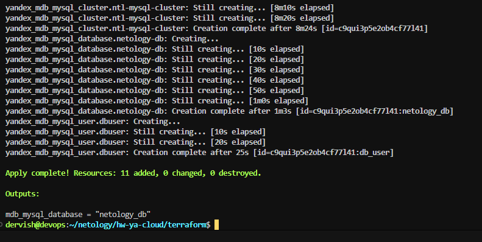
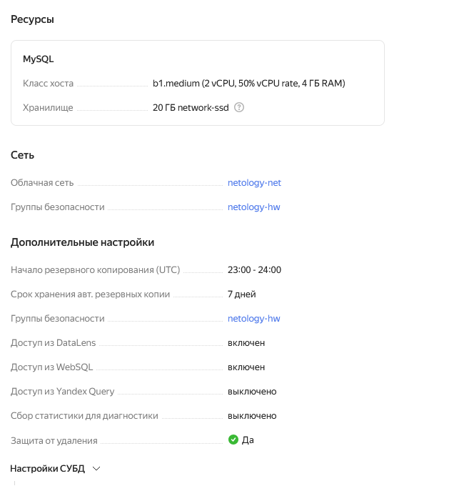

# Цели задания

1. Организация кластера Kubernetes и кластера баз данных MySQL в отказоустойчивой архитектуре.
2. Размещение в private подсетях кластера БД, а в public — кластера Kubernetes.

## Задание 1. Yandex Cloud

1. Настроить с помощью Terraform кластер баз данных MySQL.

 - Используя настройки VPC из предыдущих домашних заданий, добавить дополнительно подсеть private в разных зонах, чтобы обеспечить отказоустойчивость. 
 - Разместить ноды кластера MySQL в разных подсетях.

 >Ноды разместил только в двух зонах: ru-central1-a и ru-central1-b, поскольку в зоне ru-central1-d нет требуемого окружения

 - Необходимо предусмотреть репликацию с произвольным временем технического обслуживания.
 - Использовать окружение Prestable, платформу Intel Broadwell с производительностью 50% CPU и размером диска 20 Гб.
 - Задать время начала резервного копирования — 23:59.
 - Включить защиту кластера от непреднамеренного удаления.
 - Создать БД с именем `netology_db`, логином и паролем.

 >[vps.tf](./terraform/vpc.tf)

 >[db_cluster.tf](./terraform/db_cluster.tf)

 >[ingress.tf](./terraform/ingress.tf)

 >[variables.tf](./terraform/variables.tf)

 >[outputs.tf](./terraform/outputs.tf)

 
 
 
 
 
 
 

2. Настроить с помощью Terraform кластер Kubernetes.

 - Используя настройки VPC из предыдущих домашних заданий, добавить дополнительно две подсети public в разных зонах, чтобы обеспечить отказоустойчивость.
 - Создать отдельный сервис-аккаунт с необходимыми правами. 

>[sa_k8s.tf](./terraform/sa_k8s.tf)

 - Создать региональный мастер Kubernetes с размещением нод в трёх разных подсетях.

>[k8s.tf](./terraform/k8s.tf)

 - Добавить возможность шифрования ключом из KMS, созданным в предыдущем домашнем задании.

>[kms.tf](./terraform/kms.tf)

 - Создать группу узлов, состояющую из трёх машин с автомасштабированием до шести.

>[k8s_nodes.tf](./terraform/k8s_nodes.tf)

 - Подключиться к кластеру с помощью `kubectl`.

 - *Запустить микросервис phpmyadmin и подключиться к ранее созданной БД.
 - *Создать сервис-типы Load Balancer и подключиться к phpmyadmin. Предоставить скриншот с публичным адресом и подключением к БД.
